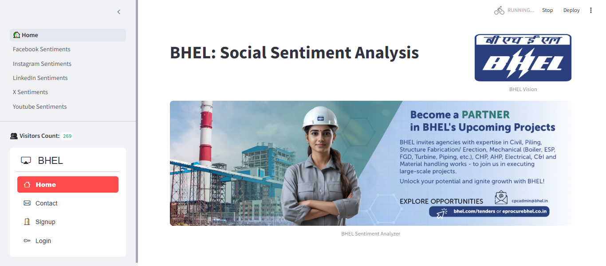
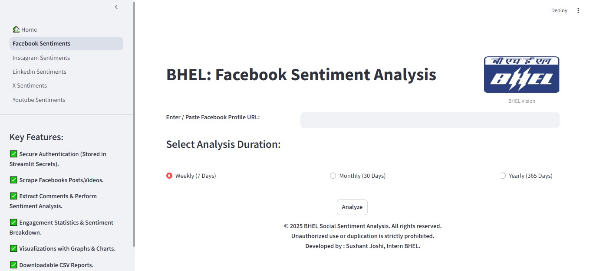
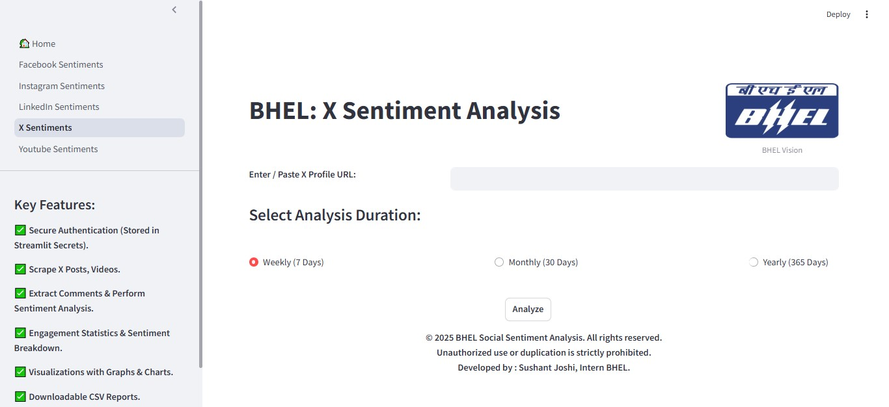
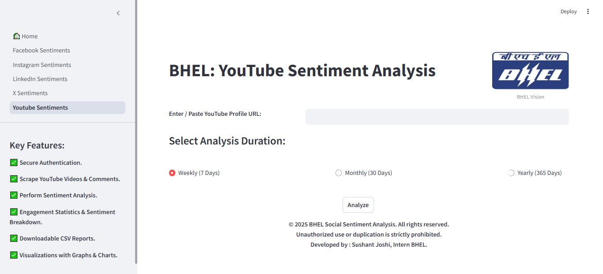
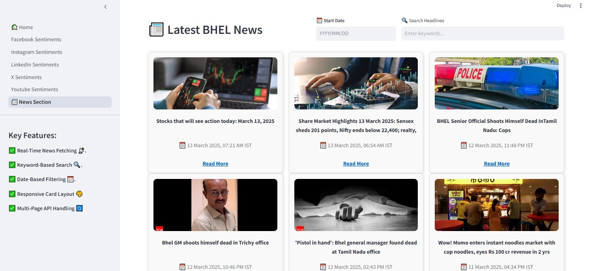

# BHEL: Social Sentiment Analysis


## ⚙️ Overview
BHEL Social Sentiment Analysis is a Streamlit web application that analyzes social media posts about **Bharat Heavy Electricals Limited (BHEL)**. It assists users in comprehending public opinion by scraping and analyzing Different Social Media Platfroms posts , videos comments. The application features secure authentication, a contact system, and a visitor counter to monitor engagement. With its user-friendly intuitive interface, interactive image sliders, and granular sentiment analysis, this tool simplifies tracking and visualizing what people say about BHEL on social media.

## 🏗 Features

**1. ✅ Secure Authentication (Stored in Streamlit Secrets)**

Enjoy a secure and seamless login experience with credentials stored in Streamlit Secrets. This ensures your authentication data remains safe, encrypted, and private from external breaches, making the platform highly secure for all users.

**2. 🔍 Scrape Different Social Media Platforms Posts & Videos**

Automatically collect Different Social Media Platforms posts related to BHEL and analyze public engagement. Stay updated on industry trends, user opinions, and brand sentiment, helping businesses make data-driven decisions in real time.

**3. 💬 Extract Comments & Perform Sentiment Analysis**

Our AI-powered tool scans post comments to determine sentiment—**Positive**, **Neutral**, or **Negative**. This analysis helps identify public opinion and provides insights into the brand’s reputation and user engagement levels.

**4. 📊 Customizable Analysis Periods**

Users can choose from three analysis periods: **Weekly (7 days)**, **Monthly (30 days)**, or **Yearly (365 days)** to get insights based on their needs, ensuring a flexible and customized sentiment analysis experience.

**5. 📉 Visualizations with Graphs & Charts**

Gain deep insights with interactive visualizations! Our platform generates bar charts, pie charts, and trend graphs to showcase sentiment trends, engagement levels, and audience behavior in an easy-to-understand format.

**6. 📁 Downloadable CSV Reports**

Export sentiment analysis results and engagement metrics into CSV files. This feature allows businesses to maintain records, conduct in-depth studies, and use the data for future strategies and reporting.

## 📷 Snapshots 

## 🏡 Home Page




## 1. Facebook Sentiment Module



## 2. Instagram Sentiment Module


## 3. LinkedIn Sentiment Module


## 4. X Sentiment Module



## 5. Youtube Sentiment Module



## News Sections 



##  🛠 Installation Guide 
**1. Clone the Repository**
```bash
   git clone https://github.com/your-repo/BHEL-Sentiment-Analysis.git
   cd BHEL-Sentiment-Analysis
```

**2. Install Dependencies**
```bash
   pip install -r requirements.txt
```

**3. Run the Application**
```bash
   streamlit run 🏡Home.py
```

## 🗄 Database Configuration  
**1. SQLite for Visitor Count**
- The project uses SQLite to maintain a visitor count.
- The database file is created automatically if not present.

**2. MySQL for User Authentication**
- Update the `st.secrets` configuration with your MySQL database credentials.
- MySQL is used to manage user registration and login.

## 👨‍💻 Tech Stack Used 
- **Python + Streamlit**
- **MySQL Database**
- **NLP & AI Sentiment Analysis**
- **Data Visualization (Matplotlib, Seaborn, Plotly)**

## 🤝 Collaboration 
We welcome contributions! If you’d like to contribute:

**1. Fork the repository**

**2. Create a new branch**

**3. Commit your changes**

**4. Open a pull request**

## 📄 License
BHEL Social Sentiment Analysis is an **open-source** Streamlit web application under the **MIT License**. It helps users analyze **Different Social Media Platforms** posts, videos comments about **Bharat Heavy Electricals Limited (BHEL)** with secure authentication, sentiment analysis, and engagement tracking.

### 🌟 **Show Some**
If you like this project, don't forget to give it a ⭐ on GitHub!

🔗**Connect With Us:** 

<a href="https://www.facebook.com/BHELOfficial/">
        
        Facebook
    </a>  
    &nbsp;&nbsp;
    
<a href="https://www.instagram.com/bhel.india/?hl=en">
        
        Instagram
    </a>  
    &nbsp;&nbsp;
    
<a href="https://www.linkedin.com/company/bhel/" target="_blank">
        
        LinkedIn
    </a>  
    &nbsp;&nbsp;&nbsp;&nbsp;&nbsp;&nbsp;&nbsp;
   

<a href="https://x.com/BHEL_India" target="_blank">
        
        X
    </a>
    &nbsp;&nbsp;


<a href="https://www.youtube.com/@bhel_india8535/featured" target="_blank">
        
        YouTube
    </a>


